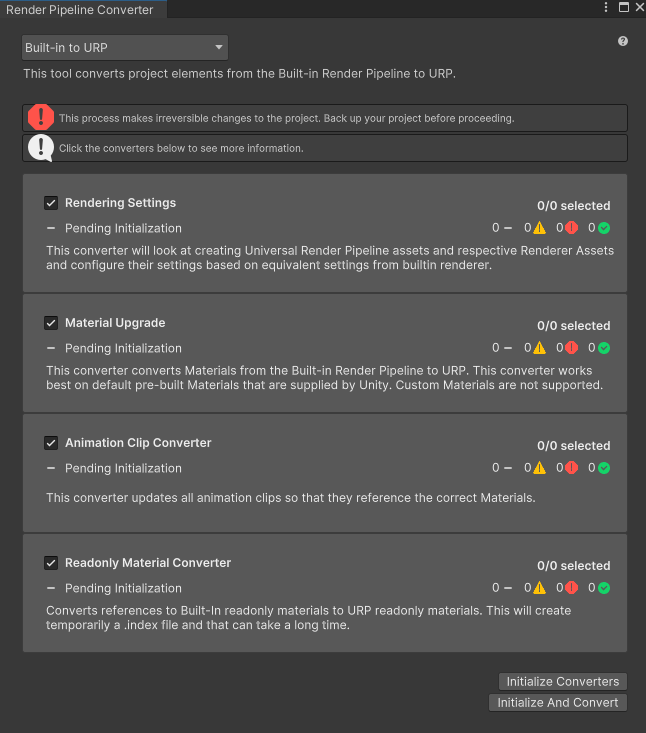

# Documentacion ZED + Unity

## Indice

* ZED + Unity
* Notas y consejos
* Links de descarga

## ZED + Unity

Para poder vicular tu sensor ZED y Unity es necesario tener instalado todos los drivers del ZED para asi poder tener un correcto funcionamiento con tu computadora.

### Instalacion de CUDA
CUDA (Compute Unified Device Architecture) es una plataforma de computación paralela y un modelo de programación creado por NVIDIA. Está diseñado para permitir que los desarrolladores utilicen la potencia de procesamiento de las unidades de procesamiento gráfico (GPU) de NVIDIA para realizar cálculos en paralelo.

A día de hoy 24/06/2024, la version mas actual de CUDA es la **CUDA Toolkit 12.5**

**Antes de instalar es importante que si cambias de version de CUDA, no tengas instalada otra version del mismo, en caso de tenerla instalada es necesario desinstalar cualquier otra version y borrar sus documentos residuales que quedan al momneto de finalizar la instalacion. En caso de no hacerlo el software no funcionara correctamente.**

#### Proceso de instalacion

1. Ve a la seccion de **Links de descargas** y da click en donde dice **Descargar CUDA**.

2. En la web oficial de NVIDIA, daras click en donde dice **Windows** o **Linux** dependiendo de tu sistema operativo

3. Configuras la descarga del software dependiendo tu sistema. Das click en descargar.

4. Instala el software normalmente.

#### Configuracion de CUDA

Terminando la instalacion del software es necesario realizar ciertas configuraciones. Para eso abriremos el la aplicacion que instalamos de nombre **ZED Diagnostic**

Nos abrira la ventana del **ZED Diagnostic** y daremos click en **Start**

Iniciara el analisis para renderizar, actualizar y poner en funcionamiento todas las herrmaientas necesarias para que funcione de manera correcta el ZED

Te saldra un mesnaje donde te dice que los modelos 3D no estan renderizados, para ese momento tendremos que dar click en **IA Models** y renderizar los modelos, en este paso se puede cerrar contantemente el software, en ese caso debes volver a iniciar los pasos hasta que al final no te marque ningun error.

Para optimizar lo modelos tenemos que selccionarlos todos y dar click en la opcion **OPTIMIZE SELECTION**. Al final tendra que quedar asi, a no ser que salga el fallo mencionado antes.

Una vez realizado todos los pasos, estara instalado y funcionando CUDA 😎.

### Implementacion ZED SDK + Unity 🎮

**Este proceso de instalacion funciona tanto para Built-In Render Pipeline, URP y HDRP, lo unico que cambia es la forma de modificar sus texturas**

#### Implementacion del ZED SDK

1. Crear un proyecto en Unity(NO IMPORTA SI ES Built-In Render Pipeline, URP o HDRP).

2. Iremos a la seccionde Window -> Package Mannager 
3. Daremos click en el simbolo de "+" que esta del lado izquierdo superior y selccionamos la opcion **Add package from git URL...**

Pegamos el siguiente link:

    https://github.com/stereolabs/zed-unity.git?path=/ZEDCamera/Assets

y damos click en **Add**

Con eso tendremos configurado y listo el SDK del ZED con unity.

#### Importar las herramientas pre-fabricadas

Dependiendo su proyecto, son dististan las herramientas que puede exportar, las herramientas que ya vienen por defecto son las siguientes:

* Seguimiento corporal
* Cartografia espacial
* Captura de realidad virtual
* Deteccion de objetos
* Colocacion de mivimientos
* Uso de OpenCV en Unity
* Realidad virtual

Para usar estas herramientas las podemos exportar desde el Package Mannager llendo al paquete de **ZED SDK** vamos a la seccion de **Samples** e importamos el paquete que se necesite.

Para este caso exportaremos la herramiente de **Body Tracking** que se encarga de seguir el movimiento de las personas.

Al darle click en **Import** nos dejara estas carpetas con lo necesario para empezar a trabajar.

Podremos ver una escena donde ya esta todo listo para empezar a probar el ZED.

### Correccion de texturas

En este caso la version de **Built-In Render Pipeline** NO necesita cambiar sus texturas, ya que el sdk esta hecho en ese pipeline.

#### Unity URP

Para cambiar las texturas y meteriales es necesario realizar lo siguiente:

1. Dirigirte a Window -> Rendering -> Render Pipeline Coverter y damos click.

2. Seleccionamos todo y le damos click en **Initialize and Convert**. Esto convertira todos los materias.

Listo, termino la configuracion de materiales en URP.

#### Unity HDRP
Para cambiar las texturas y meteriales es necesario realizar lo siguiente:

1. Dirigirte a Window -> Rendering -> HDRP Wizard

2. Damos click en **Convert All Built-in Materials to HDRP**

Listo, termino la configuracion de materiales en URP.
## Notas y consejos

## Links de descargas